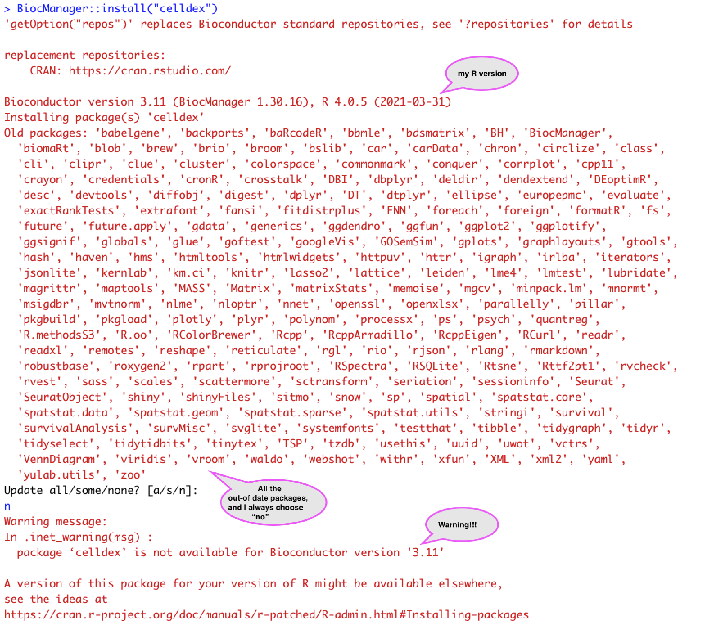

## Problem
My current R environment is R 4.0.5, with Biocondutor version 3.11. Not too new but also not too old. 
When I install new packages, I often see some messages that I need to update some packages, and I always choose no. 
But recently when I tried to install some single-cell RNA-seq analysis packages, I saw some Red warning messages, 
saying "package 'x' is not available for Bioconductor version '3.y'". While it is a warning, the installation is actually a failure-- I could not call the library.

As I encountered this issue several times, I realized that my R version is too old for many recently developed single-cell packages.
The only thing I can do to proceed is to update the R version and related Bioconductor version.

After checking this blog [How to Keep Your R Packages Up to Date](https://rfortherestofus.com/2020/09/how-to-update-rstudio-r-packages/), I follow its way and here are the steps.

## Steps
- Update R
Just use the official website to download the newest R. https://cloud.r-project.org/
- Update R Studio
Go to official website to download the newest R studio. https://www.rstudio.com/products/rstudio/download/
- Update BiocManager
```
BiocManager::install()
```

## Results
Now I can successfully install all the single-cell packages that I could not previously.
Also, it shows that the newer R and its packages are stored in a different path on my computer. 
```
/Library/Frameworks/R.framework/Versions/4.2
```
And the library is empty except the basic R and the just installed packages. 
Apparently, I will need to install all the packages under the new version again.


## the problem

